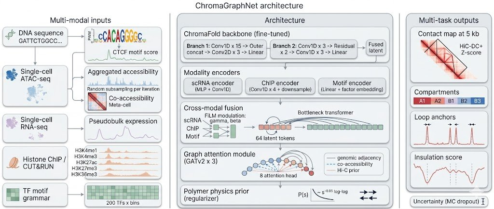

# ChromaGraphNet

**Multi-modal graph-attention prediction of 3D genome architecture, built on the ChromaFold backbone.**

[](https://opensource.org/licenses/MIT)
[](https://www.python.org/downloads/)
[](https://pytorch.org/)
[](https://pytorch-geometric.readthedocs.io/)
[](https://github.com/psf/black)

ChromaGraphNet extends [ChromaFold](https://github.com/viannegao/ChromaFold) (Gao et al., *Nature Communications* 2024) into a multi-modal, graph-aware model that jointly predicts contact maps, A/B compartment subtypes, loop anchors, and insulation scores from scATAC-seq, scRNA-seq, histone ChIP/CUT&RUN, and TF motif inputs.

The model is designed with neuronal 3D genome biology in mind. A "NeuroHi-C" inference mode for sparse chromatin fragments (e.g., CSF cell-free chromatin) is in development.



*ChromaGraphNet architecture. Multi-modal inputs (left) feed into the ChromaFold backbone and three modality-specific encoders. Cross-modal fusion combines them through FiLM modulation and a bottleneck transformer with 64 latent tokens. A 3-layer GATv2 graph attention module refines per-bin embeddings using genomic-adjacency, co-accessibility, and Hi-C-prior edges. A polymer physics prior regularizes training. Five output heads predict contact maps, compartments, loop anchors, insulation scores, and per-prediction uncertainty.*

---

## Key features

1. **ChromaFold backbone reuse**: the two-branch CNN from ChromaFold is included as a fine-tunable PyTorch module. No need to reimplement the well-validated accessibility-to-contact mapping from scratch.
2. **Multi-modal fusion**: gated FiLM modulation followed by a Perceiver-style bottleneck transformer that automatically learns which modality matters where.
3. **Graph attention**: 3 stacked GATv2 layers operate on a chromatin graph with three edge types (genomic adjacency, co-accessibility, Hi-C prior) and continuous edge features (log-distance, contact strength, CTCF orientation).
4. **Multi-task heads**: contact map, V-stripe, 5-way compartment classification (A1/A2/B1/B2/B3), loop anchors, and insulation score from a shared embedding.
5. **Polymer physics prior**: distance-decay, CTCF-convergence, and compartment phase-separation regularizers act as soft constraints during training.
6. **Bayesian uncertainty**: MC-dropout heads return per-output mean and standard deviation, supporting low-confidence flagging in clinical use.

## Architecture overview

```
                  scATAC + CTCF      Co-accessibility V-stripe
                       |                       |
                       v                       v
              [Branch 1: 15x Conv1D     [Branch 2: 3x Conv1D
               + outer concat            + 2x ResBlock
               + 3x Conv2D + Linear]      + 3x Conv1D + Linear]
                       \                 /
                        \               /
                         v             v
                    [Linear fusion: ChromaFold backbone]
                                |
                                v
                       per-bin embedding (B, L, D)
                                |
       +------------------------+-------------------------+
       |               |                |                 |
   scRNA-seq      Histone ChIP    TF motif grammar        |
       |               |                |                 |
       v               v                v                 |
   [MLP +         [Conv1D x4 +      [Linear +             |
    Conv1D]        downsample]      factor embed]         |
       \               |                /                 |
        \              v               /                  |
         +------> [Cross-modal fusion] <------------------+
                  (FiLM + bottleneck transformer)
                                |
                                v
                  [GATv2 x 3 over chromatin graph]
                                |
                                v
                  [Multi-task output heads]
                  - Contact map (5 kb)
                  - V-stripe (HiC-DC+ Z-score)
                  - Compartments (A1/A2/B1/B2/B3)
                  - Loop anchors
                  - Insulation score
                  - Uncertainty (MC dropout)
```

See [docs/architecture.md](docs/architecture.md) for full per-module details.

## Installation

ChromaGraphNet depends on PyTorch and PyTorch Geometric. Install PyTorch first to avoid solver issues, then install ChromaGraphNet.

### pip (CPU)

```bash
pip install torch --index-url https://download.pytorch.org/whl/cpu
pip install torch_geometric
pip install chromagraphnet
```

### pip (CUDA 12.1)

```bash
pip install torch --index-url https://download.pytorch.org/whl/cu121
pip install torch_geometric
pip install chromagraphnet
```

### conda

```bash
conda env create -f environment.yml
conda activate chromagraphnet
pip install -e .
```

### Docker

```bash
docker build -t chromagraphnet .
docker run --rm -v $(pwd)/data:/data chromagraphnet \
    chromagraphnet-predict --input /data/inputs.npz --output /data/predictions.npz
```

### Development install

```bash
git clone https://github.com/USERNAME/chromagraphnet.git
cd chromagraphnet
pip install -e ".[dev]"
pre-commit install
pytest
```

## Quick start

```python
import torch
from chromagraphnet import ChromaGraphNet, ChromaGraphNetConfig
from chromagraphnet import build_graph_for_window, batch_graphs

# Default config: 4.01 Mb context, 401 anchor bins at 10 kb resolution.
cfg = ChromaGraphNetConfig()
model = ChromaGraphNet(cfg)
model.eval()

# Inputs (replace with real preprocessed data; see docs/data_format.md)
B, L = 1, cfg.backbone.n_anchor_bins
acc_ctcf = torch.randn(B, 2, cfg.backbone.n_fine_bins)
coacc    = torch.randn(B, 40, cfg.backbone.n_coacc_bins)
rna      = torch.randn(B, L, 1)
chip     = torch.randn(B, 5, cfg.backbone.n_fine_bins)
motif    = torch.randn(B, L, 200)

# Build the chromatin graph for this window.
edge_index, edge_attr = build_graph_for_window(
    n_anchor_bins=L,
    coaccessibility=torch.rand(L, L),
    hic_prior=torch.rand(L, L) * 2.0,
    ctcf_orientation=torch.randint(-1, 2, (L,)),
    coacc_topk=10,
    hic_threshold=1.0,
)

with torch.no_grad():
    out = model(
        acc_ctcf=acc_ctcf, coacc=coacc, rna=rna, chip=chip, motif=motif,
        edge_index=edge_index, edge_attr=edge_attr,
    )

print(out["contact_map"].shape)         # (1, 401, 401)
print(out["compartment_logits"].shape)  # (1, 401, 5)
print(out["loop_anchor_logits"].shape)  # (1, 401)
```

A complete worked example is in [`notebooks/01_quickstart.ipynb`](notebooks/01_quickstart.ipynb).

## Pretrained models

| Name                       | Cell types       | Modalities          | Resolution | Download |
|----------------------------|------------------|---------------------|------------|----------|
| `chromagraphnet-base-v1`   | IMR90, GM12878   | ATAC + CTCF         | 10 kb      | [Zenodo (v0.1)](https://zenodo.org/) |
| `chromagraphnet-multi-v1`  | IMR90, GM12878, HUVEC | ATAC + CTCF + RNA + ChIP + motif | 10 kb | (in preparation) |
| `chromagraphnet-neuro-v1`  | Cortical neurons | ATAC + CTCF + RNA + ChIP | 10 kb | (in preparation) |

Use `load_model()` to load a checkpoint:

```python
from chromagraphnet.inference import load_model

model = load_model("checkpoints/chromagraphnet-base-v1.pt")
```

## Data preparation

ChromaGraphNet expects preprocessed inputs in the same format as ChromaFold for the accessibility and co-accessibility branches:

- **scATAC**: pseudobulk accessibility at 50 bp resolution (`numpy.float32`, length 80,200 per 4.01 Mb window).
- **CTCF**: max FIMO motif score per 50 bp bin, or CTCF ChIP-seq coverage.
- **Co-accessibility**: 500 bp Jaccard similarity matrix from ArchR metacells.
- **scRNA-seq**: log1p pseudobulk expression aggregated to 10 kb anchor bins.
- **Histone ChIP/CUT&RUN**: log1p coverage at 50 bp resolution for each mark.
- **TF motif grammar**: per-bin max FIMO score for each factor in the panel.

See [docs/data_format.md](docs/data_format.md) for full schema and example preprocessing scripts.

## Inference CLI

```bash
chromagraphnet-predict \
    --checkpoint checkpoints/chromagraphnet-base-v1.pt \
    --input data/window.npz \
    --output predictions/window_pred.npz \
    --uncertainty
```

`window.npz` should contain the keys: `acc_ctcf`, `coacc`, and optionally `rna`, `chip`, `motif`, `coacc_matrix`, `hic_prior`, `ctcf_orientation`. See `chromagraphnet-predict --help` for all options.

## Comparison with related methods

| Method              | Modalities                | Resolution | Graph | Compartments | Uncertainty |
|---------------------|---------------------------|------------|-------|--------------|-------------|
| **ChromaFold**      | ATAC + CTCF              | 10 kb      | No    | No           | No          |
| **C.Origami**       | ATAC + CTCF + sequence   | 8 kb       | No    | No           | No          |
| **Orca**            | sequence only            | 1 kb-1 Mb  | No    | No           | No          |
| **Epiphany**        | 5 epigenomic tracks      | 10 kb      | No    | No           | No          |
| **GraphReg**        | epigenome (HiChIP-derived)| 5 kb      | Yes   | No           | No          |
| **ChromaGraphNet**  | ATAC + CTCF + RNA + ChIP + motif | 10 kb (5 kb head) | Yes  | Yes (5-way) | Yes (MC dropout) |

A reproducible benchmark suite is in `scripts/benchmark/`.

## Citation

If you use ChromaGraphNet, please cite:

```bibtex
@software{chromagraphnet2026,
  author       = {Roy and Pavel, Juboraj Roy},
  title        = {ChromaGraphNet: multi-modal graph-attention prediction of 3D genome architecture},
  year         = {2026},
  publisher    = {GitHub},
  journal      = {GitHub repository},
  howpublished = {\url{https://github.com/USERNAME/chromagraphnet}},
  version      = {0.1.0},
}
```

Please also cite the upstream methods that ChromaGraphNet builds upon:

```bibtex
@article{gao2024chromafold,
  title   = {ChromaFold predicts the 3D contact map from single-cell chromatin accessibility},
  author  = {Gao, Vianne and others},
  journal = {Nature Communications},
  volume  = {15},
  pages   = {9432},
  year    = {2024},
  doi     = {10.1038/s41467-024-53628-0},
}

@inproceedings{brody2022gatv2,
  title     = {How Attentive are Graph Attention Networks?},
  author    = {Brody, Shaked and Alon, Uri and Yahav, Eran},
  booktitle = {ICLR},
  year      = {2022},
}

@inproceedings{perez2018film,
  title     = {{FiLM}: Visual Reasoning with a General Conditioning Layer},
  author    = {Perez, Ethan and Strub, Florian and de Vries, Harm and Dumoulin, Vincent and Courville, Aaron},
  booktitle = {AAAI},
  year      = {2018},
}
```

## Project status

ChromaGraphNet is an active research project. The v0.1 release ships:

- Full model architecture with random-initialized weights for inference testing.
- Smoke tests confirming forward + backward + uncertainty paths.
- Quick-start notebook with a synthetic example.

The v0.2 release will add:

- Pretrained weights on the IMR-90/GM12878/HUVEC cell lines.
- A neuron-finetuned checkpoint on Bonev et al. (2017) Hi-C.
- The full training pipeline with Hydra configs.
- A reproducible benchmark suite against ChromaFold, C.Origami, Epiphany.
- The NeuroHi-C small-fragment inference mode.

See [CHANGELOG.md](CHANGELOG.md) and the [GitHub project board](https://github.com/USERNAME/chromagraphnet/projects) for the roadmap.

## Contributing

Pull requests welcome. Please:

1. Open an issue first for non-trivial changes.
2. Run `ruff check .` and `pytest` before submitting.
3. Sign commits with `Signed-off-by` per the DCO.

See [CONTRIBUTING.md](CONTRIBUTING.md) for full guidelines.

## Acknowledgments

ChromaGraphNet builds directly on the ChromaFold codebase by Vianne Gao and colleagues. The graph attention design follows GraphReg (Karbalayghareh et al., 2022) and uses GATv2 (Brody et al., 2022). Cross-modal fusion is inspired by FiLM (Perez et al., 2018) and Perceiver IO (Jaegle et al., 2022).

## License

MIT License. See [LICENSE](LICENSE).

## Disclaimer

ChromaGraphNet is a research tool. It is **not** intended for clinical decision-making. Predictions on out-of-distribution inputs (cell types, species, or modalities not seen during training) should be treated with caution and validated experimentally.
